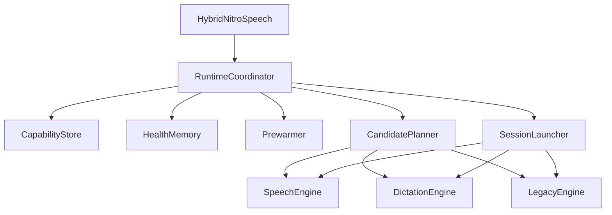

# iOS Recognition Improvement Plan

## Recommendation

Start with `#8` and `#10` first.

Those two items change the ownership of backend selection, locale support, fallback, and startup state. If we implement prewarm or timer behavior first inside the current structure, we will likely move that code again when `HybridNitroSpeech` stops being a simple OS-version switch and becomes a runtime coordinator.

## Why This Order

- Today selection is split across `[/Users/andrejkologreev/Desktop/Dev/Playground/speech/modules/nitro-speech/ios/HybridNitroSpeech.swift](/Users/andrejkologreev/Desktop/Dev/Playground/speech/modules/nitro-speech/ios/HybridNitroSpeech.swift)`, `[/Users/andrejkologreev/Desktop/Dev/Playground/speech/modules/nitro-speech/ios/HybridRecognizer.swift](/Users/andrejkologreev/Desktop/Dev/Playground/speech/modules/nitro-speech/ios/HybridRecognizer.swift)`, and `[/Users/andrejkologreev/Desktop/Dev/Playground/speech/modules/nitro-speech/ios/AnylyzerTranscriber.swift](/Users/andrejkologreev/Desktop/Dev/Playground/speech/modules/nitro-speech/ios/AnylyzerTranscriber.swift)`.
- `AnalyzerTranscriber` currently decides too much: backend choice, locale normalization, analyzer startup, and asset install.
- `LegacySpeechRecognizer` is currently excluded entirely on iOS 26+ even when it may be the best or only viable backend for a locale.
- Locale discovery should remain an init-time cache responsibility on the coordinator, not part of prewarm.

## Concurrency Note

Modern Swift uses both structured concurrency (`Task`, `async/await`, actors) and Grand Central Dispatch (`DispatchQueue`, `DispatchSourceTimer`).

- Use `Task` for async workflows, cancellation, sequencing, and calling async Apple APIs.
- Use `DispatchQueue`/`DispatchSourceTimer` when you want a simple, low-overhead timer or queue primitive that should wake at precise intervals without building a polling async loop.
- For your timer goal, a dispatch-based timer is a good fit even in modern Swift. It is not “old and wrong”; it is still the right primitive for some scheduling problems.
- So the intended timer behavior is sensible: wake at `progressIntervalMs` or `1000ms` default, emit progress, and schedule one final stop exactly when `silenceThresholdMs` elapses unless activity refreshes it.

## Target Architecture




## Phase 1: Introduce A Runtime Coordinator

- Replace the OS-version-only switch in `[/Users/andrejkologreev/Desktop/Dev/Playground/speech/modules/nitro-speech/ios/HybridNitroSpeech.swift](/Users/andrejkologreev/Desktop/Dev/Playground/speech/modules/nitro-speech/ios/HybridNitroSpeech.swift)` with a single coordinator-backed recognizer object.
- Keep the public Nitro surface spec-conformant: `prewarm(defaultParams:)`, `startListening`, `stopListening`, `addAutoFinishTime`, `updateAutoFinishTime`, `getIsActive`, `getSupportedLocalesIOS`, and callbacks.
- Make the coordinator the only public Swift hybrid recognizer object that conforms to `HybridRecognizerSpec`; engine adapters stay internal.
- Define three backend adapters behind one internal interface:
  - `SpeechTranscriber` engine
  - `DictationTranscriber` engine
  - `SFSpeechRecognizer` engine
- Move backend ranking logic out of `[/Users/andrejkologreev/Desktop/Dev/Playground/speech/modules/nitro-speech/ios/AnylyzerTranscriber.swift](/Users/andrejkologreev/Desktop/Dev/Playground/speech/modules/nitro-speech/ios/AnylyzerTranscriber.swift)`.
- Initialize internal engines lazily on first `startListening` or `prewarm`, not during coordinator init.

Essential current split point:

```12:16:ios/HybridNitroSpeech.swift
override init() {
    if #available(iOS 26.0, *) {
        recognizer = AnalyzerTranscriber()
    } else {
        recognizer = LegacySpeechRecognizer()
    }
    super.init()
}
```

## Phase 2: Unified Locale Capability Model

- On recognizer init, collect locales from:
  - `SFSpeechRecognizer.supportedLocales()`
  - `SpeechTranscriber.supportedLocales`
  - `DictationTranscriber.supportedLocales`
- Store them in one canonical cache keyed by normalized locale identifier.
- For each locale, track available backends in priority order.
- Return a deterministic sorted `string[]` from `getSupportedLocalesIOS()` for compatibility.
- Avoid the current intersection-only behavior in `[/Users/andrejkologreev/Desktop/Dev/Playground/speech/modules/nitro-speech/ios/AnylyzerTranscriber.swift](/Users/andrejkologreev/Desktop/Dev/Playground/speech/modules/nitro-speech/ios/AnylyzerTranscriber.swift)`.
- Do not move locale resolution into prewarm; prewarm may consult the cache but should not own it.

Essential current limitation:

```24:30:ios/AnylyzerTranscriber.swift
let speechLocales = await SpeechTranscriber.supportedLocales
let dictationLocales = await DictationTranscriber.supportedLocales
let intersection = Array(
    Set(speechLocales).intersection(Set(dictationLocales))
).map { loc in loc.identifier }
self.supportedLocales = intersection
```

## Phase 3: Runtime Backend Selection And Launch Fallback

- At `startListening`, build an ordered candidate list for the requested locale and config.
- Priority should be:
  - `SpeechTranscriber`
  - `DictationTranscriber`
  - `SFSpeechRecognizer`
- If request semantics require dictation-style behavior, promote `DictationTranscriber` ahead of `SpeechTranscriber` for that session.
- Launch candidates one by one until one starts successfully.
- Fallback should happen only before the session is considered started.
- If a backend fails after successful start, stop cleanly and report the error instead of hot-switching mid-session.

Requested decision tree:

- Use newer iOS 26+ APIs when they support the locale and launch correctly.
- Fall back to legacy on unsupported locale.
- Also fall back to legacy when iOS 26+ startup fails for any reason during launch.

## Phase 4: Failure Fingerprints And Session Memory

- Add a lightweight health store that remembers structural launch failures using a fingerprint, not a time-based cooldown.
- The fingerprint should be based on:
  - backend
  - full iOS version including patch
  - normalized locale
  - device model
  - request profile
- Request profile should be compact and driven only by backend-selection-relevant params such as:
  - `iosPreset`
  - `iosAddPunctuation`
  - `iosAtypicalSpeech`
  - `maskOffensiveWords` if it affects backend viability
- Keep two layers of memory:
  - session failure memory to avoid retry loops during the current app run
  - structural failure memory to demote previously bad backend choices for the same fingerprint
- Record only launch-stage failures and launch successes.
- Success for the same fingerprint should clear or sharply reduce prior failure state.
- Keep this lightweight and do not turn it into a permanent blacklist or transcript-quality ranking system.

## Phase 5: Prewarm

- Add a prewarm step owned by the coordinator, not by one concrete engine.
- Implement it through the public Nitro surface required by `HybridRecognizerSpec`: `prewarm(defaultParams: SpeechToTextParams?)`.
- Prewarm may be config-aware when `defaultParams` is provided, and generic or minimal when it is not.
- Prewarm should be able to:
  - query backend availability
  - select the likely backend using `defaultParams` when available
  - reserve/download analyzer assets when applicable
  - prepare reusable converter/backend state where practical
- Keep prewarm side-effect-free from the JS consumer perspective: no microphone start, no callbacks, no active session.
- Reuse prewarmed results on `startListening` when still valid.

## Phase 6: AutoStopper Refactor

- Refactor `[/Users/andrejkologreev/Desktop/Dev/Playground/speech/modules/nitro-speech/ios/AutoStopper.swift](/Users/andrejkologreev/Desktop/Dev/Playground/speech/modules/nitro-speech/ios/AutoStopper.swift)` so it no longer polls every 100ms.
- Desired behavior:
  - if `progressIntervalMs` is set, emit progress only on that cadence
  - otherwise emit every `1000ms`
  - schedule a final stop exactly when the current silence window expires
  - when activity is indicated, cancel and reschedule both timers
- Implementation can use `DispatchSourceTimer` or a very small pair of scheduled tasks; dispatch timers are a good choice here.

Essential current behavior to replace:

```60:75:ios/AutoStopper.swift
private func scheduleNextTick() {
    progressTask = Task { @MainActor [weak self] in
        while let self, !self.isStopped, !Task.isCancelled {
            let nowMs = Self.nowMs()
            let countdownTimeLeftMs = self.computeScheduledStopTimeLeftMs(nowMs: nowMs)
            if countdownTimeLeftMs <= 0 {
                self.onTimeout()
                return
            }
            self.reportProgress(nowMs: nowMs)
            let pollIntervalMs = min(Self.maxCheckIntervalMs, self.progressIntervalMs)
            try? await Task.sleep(nanoseconds: UInt64(pollIntervalMs * 1_000_000))
        }
    }
}
```

## Phase 7: Startup And Performance Polish

- Revisit converter reuse and engine object reuse once coordinator boundaries are in place.
- Consider prewarming `AVAudioConverter`-related setup for analyzer-backed paths if the formats are predictable enough.
- Keep logger changes out of scope for now.
- Leave legacy auto-finish audio-level changes for later, as requested.

## Files Most Likely To Change

- `[/Users/andrejkologreev/Desktop/Dev/Playground/speech/modules/nitro-speech/ios/HybridNitroSpeech.swift](/Users/andrejkologreev/Desktop/Dev/Playground/speech/modules/nitro-speech/ios/HybridNitroSpeech.swift)`
- `[/Users/andrejkologreev/Desktop/Dev/Playground/speech/modules/nitro-speech/ios/HybridRecognizer.swift](/Users/andrejkologreev/Desktop/Dev/Playground/speech/modules/nitro-speech/ios/HybridRecognizer.swift)`
- `[/Users/andrejkologreev/Desktop/Dev/Playground/speech/modules/nitro-speech/ios/AnylyzerTranscriber.swift](/Users/andrejkologreev/Desktop/Dev/Playground/speech/modules/nitro-speech/ios/AnylyzerTranscriber.swift)`
- `[/Users/andrejkologreev/Desktop/Dev/Playground/speech/modules/nitro-speech/ios/LegacySpeechRecognizer.swift](/Users/andrejkologreev/Desktop/Dev/Playground/speech/modules/nitro-speech/ios/LegacySpeechRecognizer.swift)`
- `[/Users/andrejkologreev/Desktop/Dev/Playground/speech/modules/nitro-speech/ios/AutoStopper.swift](/Users/andrejkologreev/Desktop/Dev/Playground/speech/modules/nitro-speech/ios/AutoStopper.swift)`
- Possibly one or more new coordinator/engine-state files under `[/Users/andrejkologreev/Desktop/Dev/Playground/speech/modules/nitro-speech/ios](/Users/andrejkologreev/Desktop/Dev/Playground/speech/modules/nitro-speech/ios)`

## Suggested Delivery Sequence

1. Introduce coordinator and engine abstraction.
2. Move unified locale collection and candidate ranking into the coordinator init path.
3. Add launch-time fallback plus session failure memory and fingerprint-based structural demotion.
4. Add spec-conformant prewarm on top of the new capability model.
5. Refactor `AutoStopper` once the new start lifecycle is stable.
6. Do post-refactor startup optimizations and cleanup.

